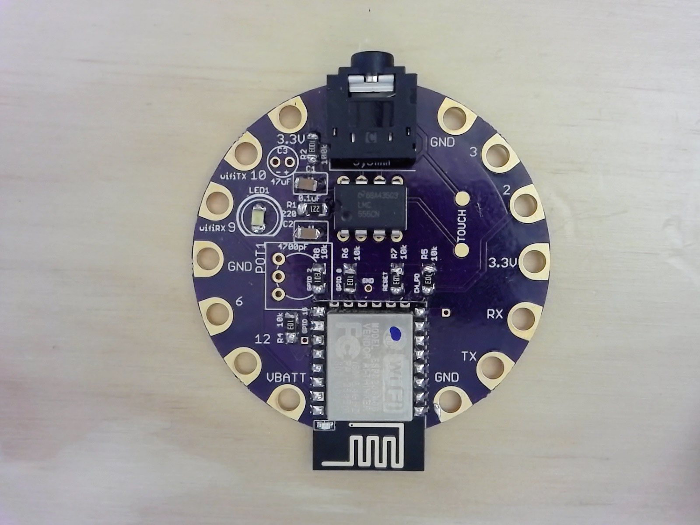
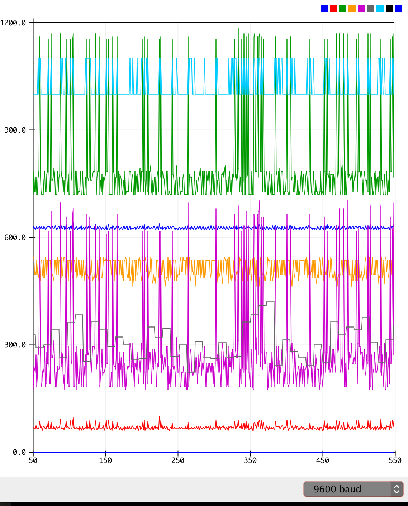

# BiodataWifi
Biodata Sonification system using ESP8266 and Adafruit CircuitPlayground Classic

Biodata Sonification is a process to translate complex real-time sensor data into musical notes and controls, exploring the auditory sensory modality to provide insights into invisible phenomenon. 

Included in this repository are an Arduino Sketch for the Adafruit Circuit Playground 32u4 'Classic' and a Server in Processing3.  Multiple Biodata Nodes can be configured on a Wifi network and their data aggregated by the Server.  Sending MIDI data to software like Ableton Live, dynamic synthesized sounds can be created.

Using the Circuit Playground Switch, Serial data can be output (+) or USB MIDI connectivity (-)

3D Printed Enclosure - 
https://www.tinkercad.com/embed/lpzT7Wl8fgM?editbtn=1
